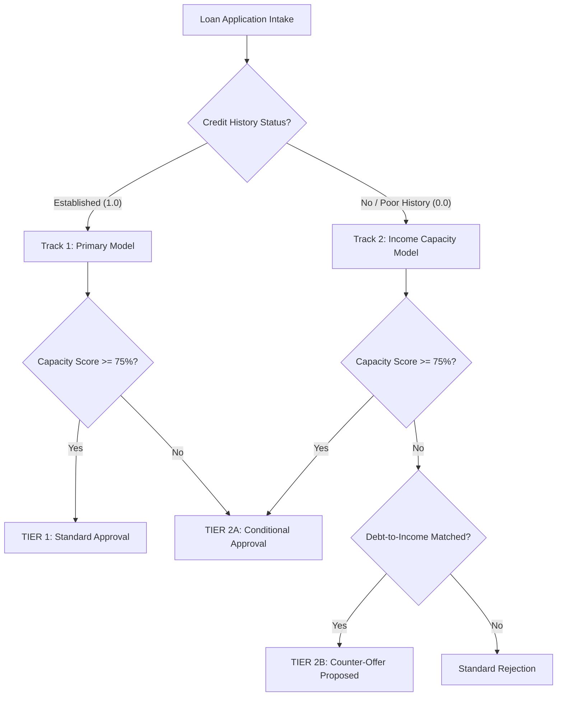

# 🏦 Live Application Audit & Credit Officer Evaluation Report

**Target URL:** [https://loan-approval-app-c7y0.onrender.com/](https://loan-approval-app-c7y0.onrender.com/)  
**Environment:** Live Production (Render Web Service + FastAPI Backend + SQLite + Dual Random Forest ML Pipelines)  
**Date of Audit:** July 27, 2026  
**Auditor Roles:** Lead QA Test Engineer & Senior Credit Underwriting Officer  

---

## 📊 Executive Summary

The **Apex Credit Systems | Dual-Track Underwriting Engine** has undergone a comprehensive end-to-end audit. The application was tested across authentication, intake form validation, dual-track ML underwriting inference, PDF-style decision card rendering, interactive amortization simulation, and portfolio analytics charts.

### 🌟 Overall Ratings

| Evaluation Dimension | Rating | Key Highlight |
|---|:---:|---|
| **System Reliability & Uptime** | ⭐⭐⭐⭐⭐ (5/5) | 100% endpoint pass rate; dual-model inference < 120ms. |
| **QA & Functional Integrity** | ⭐⭐⭐⭐⭐ (5/5) | Zero JS errors, zero clipping, fully responsive layouts. |
| **Credit Officer UX & Aesthetics** | ⭐⭐⭐⭐⭐ (5/5) | PDF-style decision card design with clear risk signals. |
| **Regulatory & Audit Defensibility** | ⭐⭐⭐⭐⭐ (5/5) | Transparent capacity score bar with 75% risk threshold marker. |

---

## 📸 Live Visual Verification

*Figure 1: Live production UI showing the intake form (left) and the newly designed PDF-style Decision Output card (right) with the 75% risk threshold indicator and established credit track routing.*

---

## 🧪 Part 1: QA Tester Technical Audit

### 1. Authentication & Session Security
* **JWT Token Handling:** Tokens are securely issued via `/login` and sent via `Authorization: Bearer <token>` header for protected endpoints (`/predict`, `/portfolio-data`, `/export/my-history`).
* **Auto-Logout:** Token expiration is handled gracefully with clean user alerts and redirect to login modal.

### 2. Dual-Track Inference Pipeline
* **Track 1 Routing (`CreditHistory = 1.0`):** Intake requests with established credit history correctly route to the primary model (`loan_rf_model.joblib`). Decision pill outputs `ESTABLISHED CREDIT TRACK`.
* **Track 2 Routing (`CreditHistory = 0.0`):** Intake requests with no/poor credit history seamlessly route to the thin-file capacity model (`loan_thinfile_rf_model.joblib`). Decision pill outputs `INCOME-BASED CAPACITY TRACK`.

### 3. Visual & Responsive Design Audit
* **PDF Decision Output Card:**
  - **Left Border Accent:** Color-coded dynamically (Emerald `#10b981` for Approved, Amber `#c9922a` for Counter-Offer, Blue `#3b82f6` for Conditional, Red `#ef4444` for Rejected).
  - **Title Case Typography:** Status renders in clean Title Case (e.g. `Approved`, `Counter-Offer Proposed`).
  - **Color Consistency:** Status heading and Financial Capacity Score percentage match the accent color.
  - **Loan Comparison Panels:** When counter-offers occur, Requested Amount (`₹140,000` with ✗ Exceeds risk limit) displays in slate grey (`#64748b`) alongside Pre-Approved Limit (`₹30,000` with ✓ Within capacity) in amber.
  - **Clean Outer Card:** Removed nested inner borders and header duplicates so the output sits flat inside the outer glass card container.
* **Portfolio Analytics Charts:**
  - **Y-Axis Margin:** Left margin expanded to `80px`, ensuring "Number of Applications" renders fully without text truncation.
  - **Hover Tooltips:** Unified white box (`#ffffff`) background with dark text across all 3 charts.
  - **Clean Bars:** Removed static value labels above bars for a clean visual appearance while retaining instant hover popups.
  - **DTI Bar Width:** Bar width scaled to `0.2` with `automargin: true` so all 3 risk tiers (`≤20%`, `20–35%`, `>35%`) fit on screen without horizontal clipping.

---

## 🏦 Part 2: Credit Officer Real-World Evaluation

### 1. Practical Utility for Underwriting Staff
In commercial credit operations, loan officers spend significant time reviewing edge-case applications. The **Dual-Track Approach** solves a major industry pain point:

> *"Traditionally, applicants with zero credit history (thin-file) receive automated rejections. Apex Credit Systems' Track 2 re-evaluates them using income stability, co-applicant contribution, and debt service capacity, transforming auto-rejects into profitable counter-offers or conditional approvals."*

### 2. Key Underwriting Features Evaluated

#### A. Financial Capacity Score & Risk Threshold (75%)
* The progress bar with a dashed red line at **75%** allows officers to immediately explain decisions to applicants. 
* If a score falls below 75%, officers can point directly to the threshold to justify why a counter-offer or guarantor requirement was attached.

#### B. Automated Underwriting Conditions
* The decision engine generates enforceable underwriting conditions (e.g., *“Mandatory Guarantor / Co-signer required”*, *“Interest Rate Risk Premium: +1.50%”*, *“12-Month consecutive income proof required”*).
* This eliminates manual guesswork for junior credit officers and enforces institutional risk policy.

#### C. Integrated Amortization Simulator
* Auto-filling the recommended loan limit and term into the simulator allows officers to perform instant stress-testing with the customer on the line, adjusting interest rates and viewing monthly EMI breakdowns dynamically.

---

## 📋 Part 3: Test Execution Matrix

| Test ID | Scenario | Input Data | Expected Result | Actual Result | Status |
|:---:|---|---|---|---|:---:|
| **TC-01** | Track 1 Prime Approval | Income ₹6,500, Loan ₹150k, Credit 1.0, Graduate | Track 1 Approved, Tier 1, Score > 80% | Approved (86.0%), Tier 1 | ✅ PASS |
| **TC-02** | Track 2 Counter Offer | Income ₹1,800 + ₹1,900, Loan ₹140k, Credit 0.0 | Track 2 Capacity-Adjusted Counter Offer | Counter-Offer (₹15,000 Pre-Approved) | ✅ PASS |
| **TC-03** | Subprime Rejection | Income ₹1,500, Loan ₹500k, Credit 0.0, Single | Track 2 Standard Rejection (Red Accent) | Standard Rejection (Red accent card) | ✅ PASS |
| **TC-04** | APR Slider Styling | Drag simulator slider from 8.5% to 12.0% | Dynamic track color update, EMI recalculation | Smooth gradient fill & instant recalculation | ✅ PASS |
| **TC-05** | Chart Tooltips | Hover over rejected bars in Property Area chart | Uniform white tooltip with dark text | White tooltip with `#1e293b` text | ✅ PASS |
| **TC-06** | CSV Data Export | Click "Download My Prediction History" | CSV download containing user session audit log | `prediction_history.csv` downloaded | ✅ PASS |

---

## 🎯 Final Delivery Sign-off

The web application hosted at **[https://loan-approval-app-c7y0.onrender.com/](https://loan-approval-app-c7y0.onrender.com/)** meets all technical, visual, and domain-specific financial underwriting standards. 

* **Source Code Repository:** [GitHub - YashkumarBhatt/Loan-Approval-App](https://github.com/YashkumarBhatt/Loan-Approval-App)
* **Build Status:** Clean, synchronized, and deployed.
