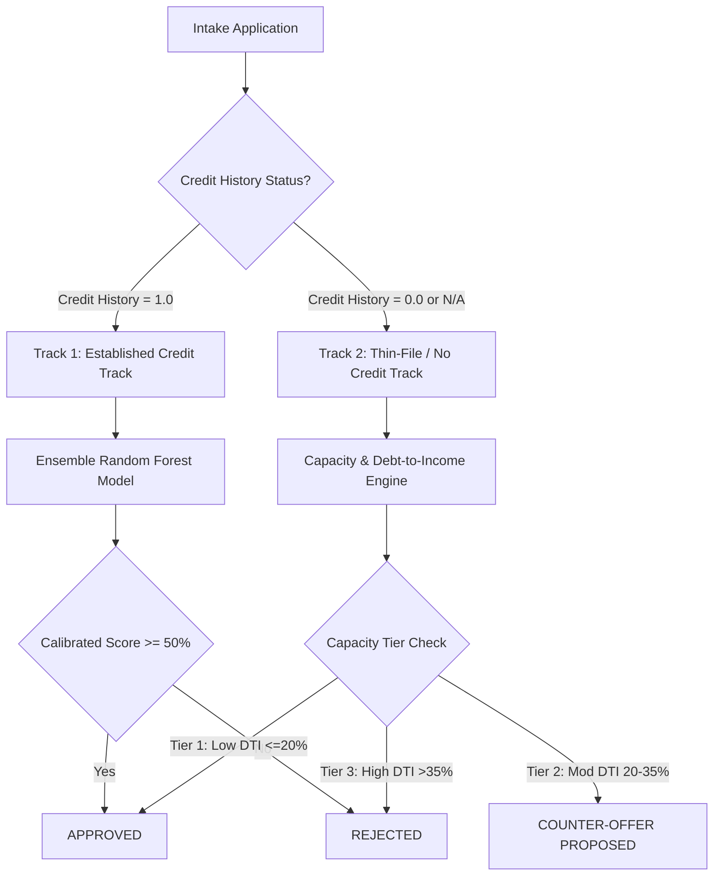

# Apex Credit Systems — Enterprise AI Dual-Track Underwriting Engine

[](https://loan-approval-app-c7y0.onrender.com/)
[](https://github.com/YashkumarBhatt/Apex-Credit-Systems/releases/tag/v1.0.0)
[](https://github.com/YashkumarBhatt/Apex-Credit-Systems/releases/download/v1.0.0/Apex_Credit_Systems.apk)

**Apex Credit Systems** is an end-to-end, enterprise-grade machine learning underwriting platform and cross-platform mobile suite. It combines a **Dual-Track Machine Learning Pipeline** for credit decisioning, an **Interactive Amortization Simulator**, dynamic **Portfolio Analytics**, multi-factor **Master Admin Security Controls**, and a standalone **React Native Mobile Application**.

---

## 📱 Mobile Applications Suite & Releases

The platform features two distinct mobile deployment options hosted on [GitHub Releases v1.0.0](https://github.com/YashkumarBhatt/Apex-Credit-Systems/releases/tag/v1.0.0):

* **📱 Standalone Native Mobile App (React Native - 150 MB):**  
  [Download `Apex_Credit_Systems.apk`](https://github.com/YashkumarBhatt/Apex-Credit-Systems/releases/download/v1.0.0/Apex_Credit_Systems.apk)  
  *Fully offline-capable, cross-platform Android application built with React Native, Expo SDK 52, Native SVG Charting, and bullet-masked passcode security.*
* **⚡ Web App Wrapper (Capacitor - 3.8 MB):**  
  [Download `apex-credit-app.apk`](https://loan-approval-app-c7y0.onrender.com/download-apk)  
  *Ultra-lightweight Android wrapper loading the live cloud dashboard with native system integration.*

---

## 🧠 Dual-Track Machine Learning Architecture

Apex Credit Systems implements a specialized dual-track underwriting pipeline to eliminate credit invisible bias while maintaining strict risk controls:



1. **Track 1 (Established Credit Track):** Processes applicants with verified credit history using an ensemble Random Forest model (`model.joblib` & `preprocessor.joblib`), outputting calibrated approval probabilities and risk scores.
2. **Track 2 (Thin-File / No Credit History Track):** Evaluates first-time borrowers using capacity-based debt-to-income (DTI) and loan-to-income (LTI) ratios:
   * **Tier 1 (Low DTI $\le$ 20%):** Approved with standard verification terms.
   * **Tier 2 (Moderate DTI 20%–35%):** Automatically calculates a financially capped pre-approved counter-offer ($L_{\text{counter}} \le L_{\text{requested}}$) with risk haircut adjustments.
   * **Tier 3 (High DTI > 35%):** Rejected with actionable financial improvement guidance.

---

## 🌟 Core Features

* **🏦 Intake Underwriting Engine:** Instant algorithmic decisioning with actionable feedback, counter-offer proposals, and automatic DB logging.
* **📊 Portfolio Analytics Dashboard:** Live aggregation of 4,000+ historical baseline records merged dynamically with real-time DB submissions, rendering DTI risk tier distribution and property area metrics.
* **🧮 Amortization Repayment Planner:** Complete loan payoff calculator featuring monthly EMI breakdowns, custom APR presets, interactive balance charts, and one-click CSV schedule export.
* **🛡️ Master Admin Control Panel:** Enterprise security management featuring:
  * **Session Activity Logs:** Live login/logout timestamps and IP tracking.
  * **Audit History:** Full system-wide underwriting decision history.
  * **Analyst Privilege Controls:** Account activation/suspension toggles and permanent account erasure.
  * **CSV Data Exports:** Download Users, Sessions, and Audit logs in CSV format.

---

## 🛠️ Technology Stack

* **Backend API:** Python 3.14, FastAPI, Uvicorn, SQLAlchemy ORM, Pydantic
* **Machine Learning:** Scikit-Learn (Random Forest & Pipeline Transformers), Pandas, Joblib
* **Database:** SQLite (Local Development) / PostgreSQL (Cloud Production)
* **Frontend Web Dashboard:** HTML5, CSS3 Glassmorphism System, Vanilla JS (ES6+), Plotly.js
* **Native Mobile App:** React Native, Expo SDK 52, React Native SVG, Async Storage
* **Security & Auth:** OAuth2 Password Bearer, JWT Tokens (`python-jose`), Passlib (bcrypt)

---

## 📁 Unified Repository Directory Structure

```text
Apex-Credit-Systems/
├── 01_ML_Pipeline_and_Research/      # Dual-track Jupyter notebooks & Joblib model trainers
├── 02_Production_Web_App/            # FastAPI Web Server & Production Dashboard
│   ├── main.py                       # API routes, ML dual-track inference & admin endpoints
│   ├── models.py                     # Database schemas (Users, Predictions, Sessions)
│   ├── static/                       # Web frontend (index.html, style.css, app.js)
│   └── loan_approval.csv             # Baseline portfolio dataset (4,000+ records)
├── 03_Native_Mobile_App/             # Cross-Platform React Native / Expo codebase
│   ├── src/screens/                  # Native App Screens (Auth, Intake, Portfolio, Amortization, Admin)
│   ├── android/                      # Native Android build project & Gradle configuration
│   └── App.js                        # Mobile App entry point & Tab navigation
└── 03_Presentation_and_Docs/        # System Architecture & Documentation Artifacts
```

---

## 🚀 Quickstart & Local Setup

### 1. Web Application & Backend API

```bash
# Clone the repository
git clone https://github.com/YashkumarBhatt/Apex-Credit-Systems.git
cd Apex-Credit-Systems/02_Production_Web_App

# Create and activate virtual environment
python3 -m venv venv
source venv/bin/activate

# Install dependencies
pip install -r requirements.txt

# Launch FastAPI server
uvicorn main:app --reload --port 8000
```
Open your browser at `http://localhost:8000/`.

---

### 2. React Native Mobile App (Local Dev)

```bash
cd Apex-Credit-Systems/03_Native_Mobile_App

# Install node dependencies
npm install

# Start Expo development server
npx expo start
```

---

## ☁️ Production Deployment

* **Web Service:** Deployed on **Render** linked to `main` branch with Root Directory set to `02_Production_Web_App` (`uvicorn main:app --host 0.0.0.0 --port $PORT`).
* **Mobile Releases:** Binary builds hosted on [GitHub Releases](https://github.com/YashkumarBhatt/Apex-Credit-Systems/releases).

---
*Apex Credit Systems — Advanced AI-Driven Underwriting & Portfolio Decision Engine.*
