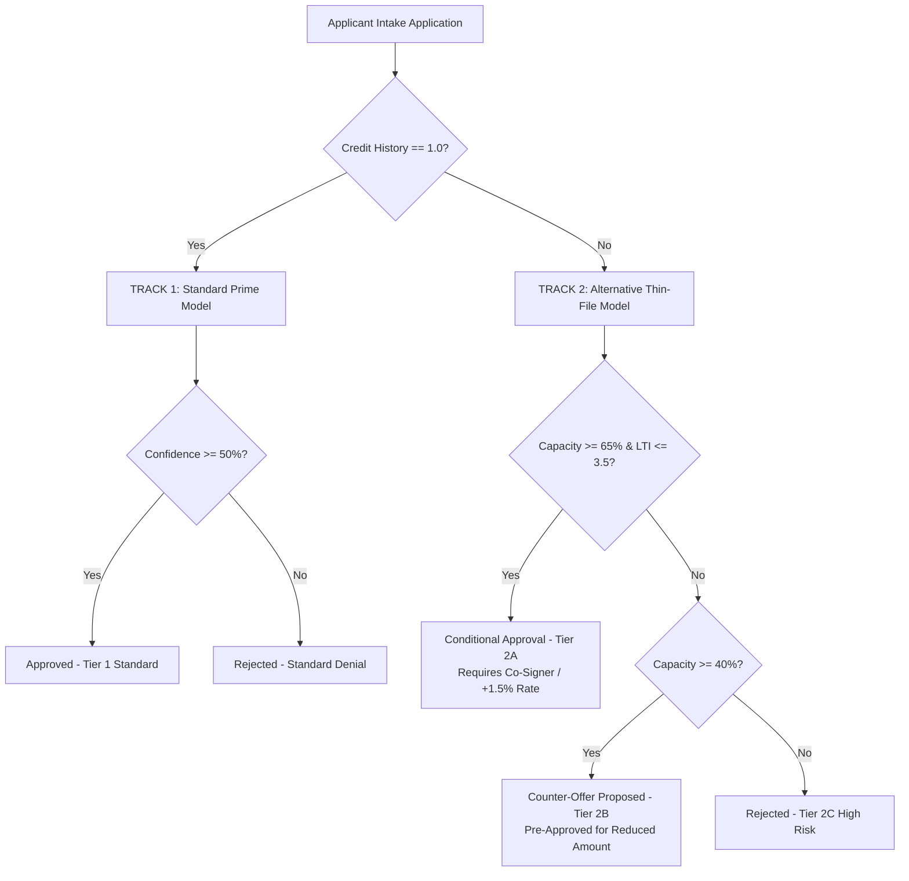

# Implementation Plan: Dual-Track Segmented Routing & Risk Tiering Upgrade

Upgrade the loan decision engine across the machine learning research notebook, Streamlit prototype, and production FastAPI web application to implement **Dual-Track Segmented Routing with Risk Tiering**.

This addresses the domination of `CreditHistory` by creating a dedicated **Alternative Capacity Track** for zero-credit applicants (`CreditHistory == 0.0`), allowing high-income borrowers to receive **Conditional Approvals** or **Counter-Offers** instead of automated denial.

---

## Architecture Overview



---

## User Review Required

> [!IMPORTANT]
> **New Trained Model Artifacts**:
> - `loan_thinfile_rf_model.joblib` (Random Forest Classifier trained without `CreditHistory`).
> - `loan_thinfile_preprocessor.joblib` (Scikit-Learn preprocessor for thin-file features).
>
> **Dual-Track Decision Outcomes**:
> 1. **Tier 1 - Standard Approval**: Approved via Track 1 (Prime).
> 2. **Tier 2A - Conditional Approval**: Approved via Track 2 (Thin-File) with conditions (Co-signer required, +1.5% interest rate risk premium).
> 3. **Tier 2B - Counter-Offer Proposed**: Approved via Track 2 for a lower loan amount (e.g., requested $250k, pre-approved for $120k).
> 4. **Tier 2C / Standard Rejection**: High-risk denial with actionable advice.

---

## Proposed Changes

### Component 1: ML Research & Notebook (`01_ML_Pipeline_&_Research`)

#### [MODIFY] [LR_DT_Loan_Approval.ipynb](file:///Users/yashbhatt/Downloads/Apex_Credit_Systems/01_ML_Pipeline_&_Research/LR_DT_Loan_Approval.ipynb)
- Add **Section 8: Dual-Track Segmented Routing & Thin-File Model Training**.
- Train `thinfile_rf_model` without the `CreditHistory` feature.
- Implement the python `evaluate_dual_track_application()` routing engine.
- Re-run stress test on the 3 applicant profiles:
  - **Young High Earner** ($120k Income, $150k Loan, 0 Credit): Moves from outright rejection to **Conditional Approval (Tier 2A)**.
  - **Recovering Couple** ($130k Joint, $250k Loan, 0 Credit): Moves to **Counter-Offer Proposed (Tier 2B)**.
  - **Conservative Borrower** ($85k Income, $50k Loan, 0 Credit): Moves to **Conditional Approval (Tier 2A)**.
- Export `loan_thinfile_rf_model.joblib` and `loan_thinfile_preprocessor.joblib`.

#### [MODIFY] [app.py](file:///Users/yashbhatt/Downloads/Apex_Credit_Systems/01_ML_Pipeline_&_Research/app.py)
- Load both Prime and Thin-File models.
- Render Dual-Track routing badges (`Standard Prime Track` vs `Alternative Thin-File Track`), decision tiers, conditional terms, and counter-offer loan amounts in the Streamlit UI.

---

### Component 2: Deployed Production Web App (`02_Production_Web_App`)

#### [NEW] `loan_thinfile_rf_model.joblib` & `loan_thinfile_preprocessor.joblib`
- Copy trained model binaries to `02_Production_Web_App/`.

#### [MODIFY] [main.py](file:///Users/yashbhatt/Downloads/Apex_Credit_Systems/02_Production_Web_App/main.py)
- Load both models upon startup.
- Update `/predict` API route to execute Dual-Track routing and return enhanced JSON:
  ```json
  {
    "prediction": 1,
    "confidence_percentage": 78.4,
    "status": "Conditional Approval",
    "track": "Alternative Thin-File Track",
    "tier": "Tier 2A - Conditional Approval",
    "conditions": [
      "Mandatory Guarantor / Co-signer required",
      "Interest Rate Risk Premium: +1.5%"
    ],
    "counter_offer_amount": null,
    "actionable_notes": "High financial capacity detected despite zero credit history."
  }
  ```

#### [MODIFY] [static/index.html](file:///Users/yashbhatt/Downloads/Apex_Credit_Systems/02_Production_Web_App/static/index.html) & [static/app.js](file:///Users/yashbhatt/Downloads/Apex_Credit_Systems/02_Production_Web_App/static/app.js)
- Update decision output panel to render:
  - Track Badge (`Prime Track` vs `Thin-File Track`).
  - Tier Badge (`Tier 1`, `Tier 2A`, `Tier 2B`, `Tier 2C`).
  - Bulleted list of Approval Conditions (if Tier 2A).
  - Counter-Offer Notification Box showing pre-approved loan limit (if Tier 2B).

---

## Verification Plan

### Automated Execution & Testing
1. Run execution script to generate and run `LR_DT_Loan_Approval.ipynb` end-to-end, confirming zero errors.
2. Verify exported `.joblib` files exist and are valid.
3. Test local FastAPI server `/predict` endpoint with the 3 test applicant payloads to verify JSON response structure.

### Manual Verification
1. Launch `streamlit run app.py` and test applicant inputs.
2. Test production web app in browser to verify UI rendering of Conditional Approval badges and Counter-Offer metrics.
